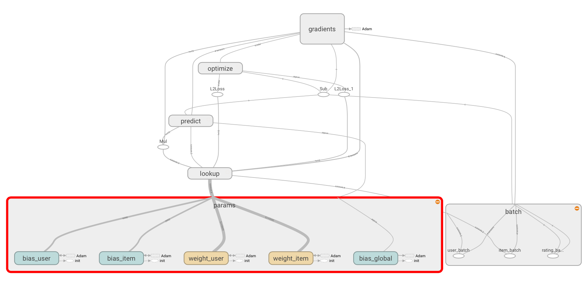

# TensorFlowRecommender
### Tensorflow-based Recommendation systems

This is a TensorFlow implementation of the a factorization model for recommender systems. There are many variants of factor models, but they all assume that there are latent features in either the users, the items, or both, that capture the interactions between the two. In this project, a simple SVD algorithm is generated.

It is based on the excellent Github repo [TF-recomm](https://github.com/songgc/TF-recomm). This repository showed how to write a TensorFlow model that would efficiently perform mini-batch SGD (Stochastic Gradient Descent). The biggest downside is that the model would train the embedding vectors to minimize the mean squared error (MSE) between the predicted and actual ratings, and then return. In particular, the `tensorflow.session` object was closed once the MSE was found at the end of the training. Once a `tensorflow.session` closes, all information about the weights and biases found are also destroyed.

To use this model to make predictions, there were two approaches:

1. At the end of the `TF-recomm` training function `svd`, save the model to disk. Then restore the model later to make predictions.
2. Rewrite the training so that the `session` isn't closed at the end.

In this project, the second option has been implemented. Because the `session` holds onto values (and memory) for the entire model until closed, we made the class `TensorFlowRecommender` which is responsible  for managing the life cycle of the session. `TensorFlowRecommender` has a similar interface to BaseEstimator models in `scikitlearn`, with `fit` and `predict` functions.

Other minor differences from `TF-recomm`:
* (+) Grouped the operations, so that the visualization of the computational graph is a little cleaner
* (+) No longer hard-coding the number of users or items, so you can use this on your own dataset
* (+) Implemented `predictTopK` function, which will find the `K` items with the highest predicted rating for a given user
* (-) Did not implement multiple devices (for simplicity).
* (-?) Eliminated the file `ops.py`, moving all graph operations into the `TensorFlowRecommender` class. It could be argued that  `TensorFlowRecommender.fit` is too long as it stands.

If performance is important, you should probably use the original `TF-recomm` model which utilized the GPUs, save the model, and then restore it later. This project is used to demonstrate how to use a persistent session to make predictions.

### Requirements
* Tensorflow >= r0.12 (Since Tensorflow is changing high-level APIs frequently, please check its version if errors happen.)
* Numpy
* Pandas

### Data set
[MovieLens](http://grouplens.org/datasets/movielens/) 1M data set is used. It looks as follows. The columns are user ID, item ID, rating, and timestamp
```
1::1193::5::978300760
1::661::3::978302109
1::914::3::978301968
1::3408::4::978300275
1::2355::5::978824291
```
The problem is to predict the rating given by user u and item i. The metric is typically RMSE between the true ratings and predictions.

### SVD implementation

#### Graph
Given by user u and item i, the inference of the classic SVD is
```
y_pred[u, i] = global__bias + bias_user[u] + bias_item_[i] + <embedding_user[u], embedding_item[i]>
```
The objective is to minimize
```
\sum_{u, i} |y_pred[u, i] - y_true[u, i]|^2 + \lambda(|embedding_user[u]|^2 + |embedding_item[i]|^2)
```
The above can be directly written by Tensorflow DSL as the [operations](https://github.com/songgc/TF-recomm/blob/master/ops.py). The Adam algorithm is used for the optimizer. The TF graph would be like


#### Run
```bash
./download_data.sh
python svd_train_val.py
```
The results would be as follows. The validation RMSE is around or below 0.850.
```
epoch train_error val_error elapsed_time
  0 2.637530 2.587753 0.129696(s)
  1 1.034569 0.908686 4.110165(s)
  2 0.859582 0.887105 4.137014(s)
  3 0.835467 0.878246 4.132146(s)
  ...
 97 0.742144 0.849553 4.114120(s)
 98 0.742159 0.849624 4.120170(s)
 99 0.742281 0.849537 4.133140(s)
```

#### Speed tuning
To enable GPU for math operations, just set DEVICE="/gpu:0". The computation time of one epoch reduced from 4.1 to 3.4s.

Changing the batch size from 1000 to 10000. One epoch only requires 1.1s.

If you have large data, it is better to use TF [data pipeline](https://www.tensorflow.org/versions/r0.8/how_tos/reading_data/index.html).

### Others:
SVD++ will be provided soon.

### Reference
[Factorization Meets the Neighborhood: a Multifaceted Collaborative Filtering Model](http://www.cs.rochester.edu/twiki/pub/Main/HarpSeminar/Factorization_Meets_the_Neighborhood-_a_Multifaceted_Collaborative_Filtering_Model.pdf)
